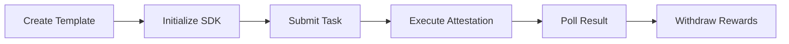

# Primus zkTLS API Documents

📚 Complete API documentation and usage guides for Primus Network SDK.

---

## 📖 Documentation

| Document | Description |
|----------|-------------|
| [🚀 Quick Start](./QUICKSTART.md) | Get started in 5 minutes, complete your first Attestation |
| [📋 API Reference](./API-REFERENCE.md) | Complete API reference documentation |
| [📝 Examples](./examples/) | Runnable example code |
| [🇨🇳 中文文档](./README-CN.md) | 中文版本文档 |

---

## 🎯 What is Primus Network SDK?

PrimusNetwork SDK is a TypeScript library for interacting with the Primus zkTLS network. It enables developers to:

- ✅ **Verify Off-Chain Data** - Attest Web2 API data through zkTLS proofs
- ✅ **Protect Privacy** - Use zero-knowledge proof technology
- ✅ **On-Chain Verification** - Submit verification results to blockchain
- ✅ **Build Trusted Apps** - Create DApps based on real-world data

### Core Features

```
┌─────────────────────────────────────────────────────────────┐
│                    Primus Network SDK                        │
├─────────────────────────────────────────────────────────────┤
│  🔗 Wallet Connect  │  Connect MetaMask and other wallets   │
│  📝 Task Submit     │  Submit Attestation tasks to network  │
│  ✅ Execute Attest  │  Perform zkTLS verification with nodes│
│  🔄 Result Polling  │  Query task status and results        │
│  💰 Withdraw Rewards│  Withdraw settled rewards from contract│
└─────────────────────────────────────────────────────────────┘
```

---

## 🚀 Quick Start

### Installation

```bash
npm install @primuslabs/network-js-sdk ethers@5
```

### Minimal Working Example

```typescript
import { PrimusNetwork } from "@primuslabs/network-js-sdk";
import { ethers } from "ethers";

// 1. Initialize
const provider = new ethers.providers.Web3Provider(window.ethereum);
const signer = provider.getSigner();
const primusNetwork = new PrimusNetwork();
await primusNetwork.init(signer, 84532); // Base Sepolia

// 2. Submit Task
const submitResult = await primusNetwork.submitTask({
  templateId: "YOUR_TEMPLATE_ID",
  address: await signer.getAddress()
});

// 3. Execute Attestation
const attestResult = await primusNetwork.attest({
  ...submitResult,
  templateId: "YOUR_TEMPLATE_ID",
  address: await signer.getAddress()
});

// 4. Get Result
const taskResult = await primusNetwork.verifyAndPollTaskResult({
  taskId: attestResult[0].taskId,
  reportTxHash: attestResult[0].reportTxHash
});

console.log("Verification Result:", taskResult);
```

---

## 📦 Supported Networks

| Network | Chain ID | Status |
|---------|----------|--------|
| Base Sepolia | 84532 | ✅ Testnet |
| Base Mainnet | 8453 | ✅ Mainnet |

---

## 🔗 Resources

- **Developer Platform**: https://dev.primuslabs.xyz
- **Chrome Extension**: [Primus Extension](https://chromewebstore.google.com/detail/primus-prev-pado/oeiomhmbaapihbilkfkhmlajkeegnjhe)
- **SDK Source**: https://github.com/primus-labs/primus-network-sdk
- **Example Projects**: https://github.com/primus-labs/zktls-demo
- **Discord Community**: https://discord.gg/primus

---

## 📝 Workflow



1. **Create Template** - Create Attestation template at [Developer Platform](https://dev.primuslabs.xyz)
2. **Initialize SDK** - Connect wallet and initialize SDK
3. **Submit Task** - Call `submitTask()` to create a task
4. **Execute Attestation** - Call `attest()` to perform verification
5. **Poll Result** - Call `verifyAndPollTaskResult()` to get results
6. **Withdraw Rewards** - (Optional) Call `withdrawBalance()` to withdraw rewards

---

## 💡 Use Cases

### 1. Social Media Account Verification

Verify user ownership of a social media account (e.g., Twitter/X):

```typescript
const result = await primusNetwork.submitTask({
  templateId: "twitter-ownership-template-id",
  address: userAddress
});
```

### 2. Income Proof

Verify user's income level (without exposing exact amount):

```typescript
const result = await primusNetwork.submitTask({
  templateId: "income-verification-template-id",
  address: userAddress
});
```

### 3. Credit Score

Verify user's credit score:

```typescript
const result = await primusNetwork.submitTask({
  templateId: "credit-score-template-id",
  address: userAddress
});
```

---

## 🛠️ Development Environment

- **Node.js**: >= 16.x
- **TypeScript**: >= 4.9.x
- **ethers**: 5.x
- **Browser**: Modern browsers with MetaMask support

---

## 📄 License

MIT License

---

**Maintained by**: Primus Labs  
**Last Updated**: 2026-02-28
