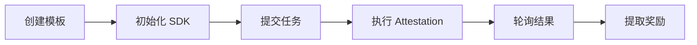

# Primus zkTLS API Documents

📚 Primus Network SDK 完整 API 文档和使用指南。

---

## 📖 文档目录

| 文档 | 描述 |
|------|------|
| [🚀 快速入门](./QUICKSTART.md) | 5 分钟上手，完成第一次 Attestation |
| [📋 API 参考](./API-REFERENCE.md) | 完整的 API 接口文档 |
| [📝 示例代码](./examples/) | 可运行的示例代码 |

---

## 🎯 什么是 Primus Network SDK？

PrimusNetwork SDK 是一个 TypeScript 库，用于与 Primus zkTLS 网络进行交互。它使开发者能够：

- ✅ **验证链下数据** - 通过 Attestation 验证 Web2 API 数据
- ✅ **保护隐私** - 使用零知识证明技术
- ✅ **链上验证** - 将验证结果提交到区块链
- ✅ **构建可信应用** - 创建基于真实世界数据的 DApp

### 核心功能

```
┌─────────────────────────────────────────────────────────────┐
│                    Primus Network SDK                        │
├─────────────────────────────────────────────────────────────┤
│  🔗 钱包连接    │  连接 MetaMask 和其他钱包                  │
│  📝 任务提交    │  向网络提交 Attestation 任务               │
│  ✅ 执行验证    │  使用 Attestor 节点进行 zkTLS 验证         │
│  🔄 结果轮询    │  查询任务状态和结果                        │
│  💰 奖励提取    │  从合约提取结算的奖励                      │
└─────────────────────────────────────────────────────────────┘
```

---

## 🚀 快速开始

### 安装

```bash
npm install @primuslabs/network-js-sdk ethers@5
```

### 最小可用示例

```typescript
import { PrimusNetwork } from "@primuslabs/network-js-sdk";
import { ethers } from "ethers";

// 1. 初始化
const provider = new ethers.providers.Web3Provider(window.ethereum);
const signer = provider.getSigner();
const primusNetwork = new PrimusNetwork();
await primusNetwork.init(signer, 84532); // Base Sepolia

// 2. 提交任务
const submitResult = await primusNetwork.submitTask({
  templateId: "YOUR_TEMPLATE_ID",
  address: await signer.getAddress()
});

// 3. 执行 Attestation
const attestResult = await primusNetwork.attest({
  ...submitResult,
  templateId: "YOUR_TEMPLATE_ID",
  address: await signer.getAddress()
});

// 4. 获取结果
const taskResult = await primusNetwork.verifyAndPollTaskResult({
  taskId: attestResult[0].taskId,
  reportTxHash: attestResult[0].reportTxHash
});

console.log("验证结果:", taskResult);
```

---

## 📦 支持的网络

| 网络 | Chain ID | 状态 |
|------|----------|------|
| Base Sepolia | 84532 | ✅ 测试网 |
| Base Mainnet | 8453 | ✅ 主网 |

---

## 🔗 相关资源

- **开发者平台**: https://dev.primuslabs.xyz
- **Chrome 扩展**: [Primus Extension](https://chromewebstore.google.com/detail/primus-prev-pado/oeiomhmbaapihbilkfkhmlajkeegnjhe)
- **SDK 源码**: https://github.com/primus-labs/primus-network-sdk
- **示例项目**: https://github.com/primus-labs/zktls-demo
- **Discord 社区**: https://discord.gg/primus

---

## 📝 使用流程



1. **创建模板** - 在 [开发者平台](https://dev.primuslabs.xyz) 创建 Attestation 模板
2. **初始化 SDK** - 连接钱包并初始化 SDK
3. **提交任务** - 调用 `submitTask()` 创建任务
4. **执行 Attestation** - 调用 `attest()` 进行验证
5. **轮询结果** - 调用 `verifyAndPollTaskResult()` 获取结果
6. **提取奖励** - (可选) 调用 `withdrawBalance()` 提取奖励

---

## 💡 典型用例

### 1. 社交媒体账号验证

验证用户拥有某个社交媒体账号（如 Twitter/X）：

```typescript
const result = await primusNetwork.submitTask({
  templateId: "twitter-ownership-template-id",
  address: userAddress
});
```

### 2. 收入证明

验证用户的收入水平（不暴露具体金额）：

```typescript
const result = await primusNetwork.submitTask({
  templateId: "income-verification-template-id",
  address: userAddress
});
```

### 3. 信用评分

验证用户的信用评分：

```typescript
const result = await primusNetwork.submitTask({
  templateId: "credit-score-template-id",
  address: userAddress
});
```

---

## 🛠️ 开发环境

- **Node.js**: >= 16.x
- **TypeScript**: >= 4.9.x
- **ethers**: 5.x
- **浏览器**: 支持 MetaMask 的现代浏览器

---

## 📄 许可证

MIT License

---

**文档维护者**: Primus Labs  
**最后更新**: 2026-02-28
